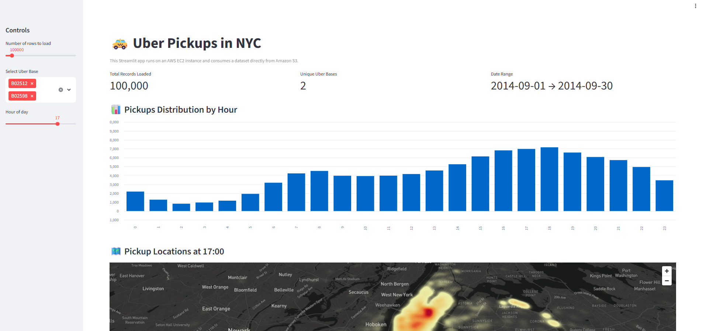
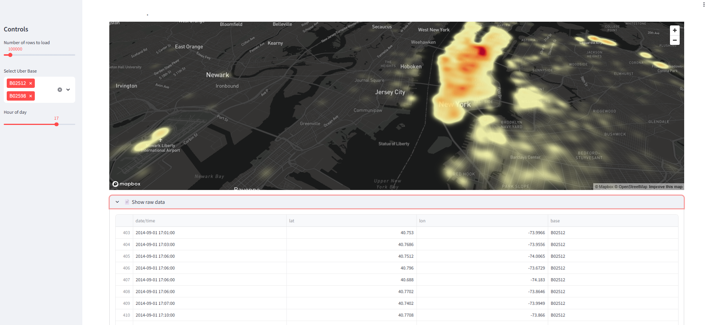

# 🚕 Uber Pickups – AWS EC2 + S3 + Streamlit

This project is a simple data visualization app built with **Streamlit**, running on an **AWS EC2 instance** and consuming a public dataset stored in **Amazon S3**.

The app analyzes Uber pickup data in New York City and provides interactive charts and a geospatial heatmap.

---

<p align="center">
  
</p>

## 📊 Dataset

- Source: Public Uber pickup dataset (September 2014)
- Size: ~1,000,000 rows
- Format: CSV (compressed)
- Loaded directly from Amazon S3

---

## 🧰 Tech Stack

- Python 3.9
- Streamlit
- Pandas / NumPy
- PyDeck (Mapbox)
- AWS EC2
- Amazon S3

---

## 🚀 Features

- Cached data loading for better performance
- Interactive filters (hour of day and Uber base)
- Histogram of pickups by hour
- Geospatial heatmap of pickup locations
- Mapbox integration for enhanced visualization

<p align="center">
  
</p>

## ▶️ How to Run

### 1. Clone the repository
```bash
git clone https://github.com/Jownao/aws-first-streamlit
cd aws-first-streamlit
````

### 2. Create and activate a virtual environment

```bash
python3 -m venv venv
source venv/bin/activate
```

### 3. Install dependencies

```bash
pip install -r requirements.txt
```

### 4. Set Mapbox token (optional but recommended)

```bash
export MAPBOX_API_KEY="your_mapbox_token"
```

### 5. Run the app

```bash
streamlit run app.py --server.address 0.0.0.0 --server.port 80
```

---

## ☁️ Deployment Notes

* The app is designed to run on an AWS EC2 instance
* Port **80** must be allowed in the EC2 Security Group
* Dataset is fetched directly from Amazon S3 at runtime

---

## 🎯 Purpose

This project was created as a **learning exercise** to better understand:

* Cloud-based application deployment
* Data consumption from S3
* Performance considerations with large datasets
* Building interactive data apps with Streamlit

---

## 📌 Next Improvements

* Add Nginx as a reverse proxy
* Enable HTTPS
* Optimize loading for the full dataset
* Containerize the app with Docker

